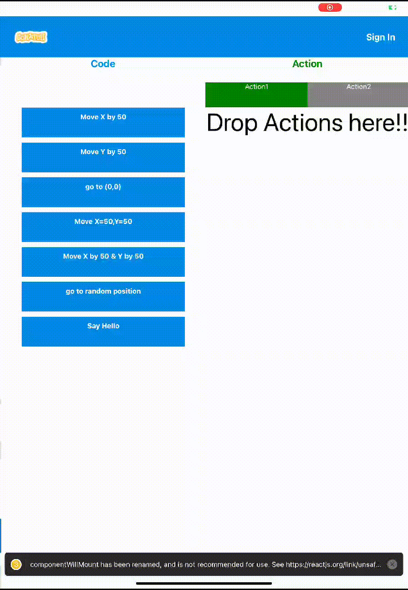
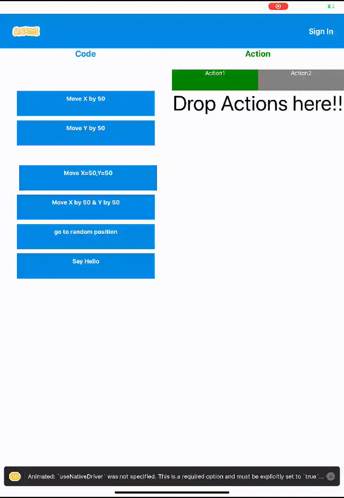

## React Native Sprite Animation Application

## Built Using
- [React Native](https://reactnative.dev/)
- [Context API](https://legacy.reactjs.org/docs/context.html)
- [Animated Library](https://reactnative.dev/docs/animated)
- [Pan Responder](https://reactnative.dev/docs/panresponder)

## Demo

Animated Sprite can move anywhere on the screen, Also,an additonal sprite can be added to the screen.

##

Action can be selected by simple drag and drop which will be later performed by the sprite if the user presses play button

##

Action items are implementing Spring action i.e. if user drags and releases item it gets restores to its orignal position.

