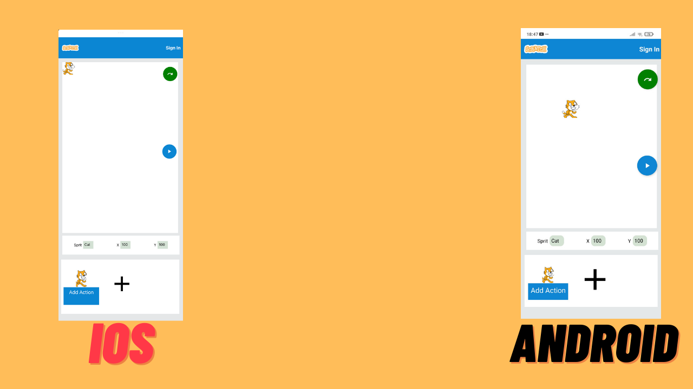
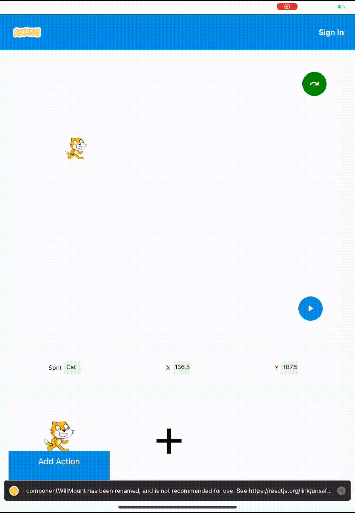
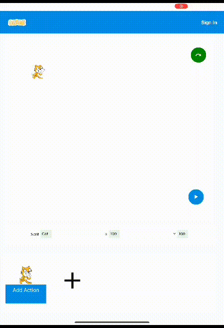
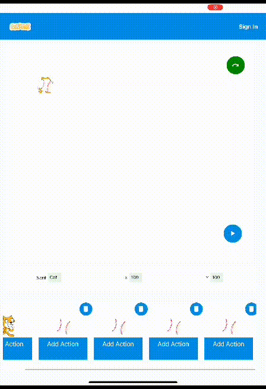
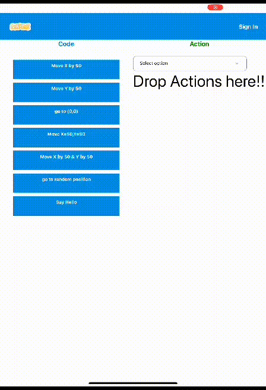
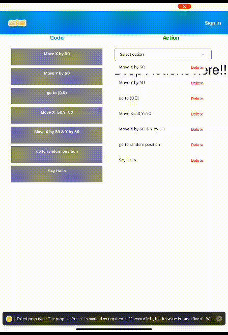
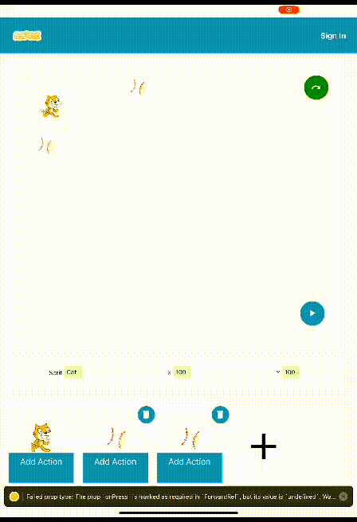
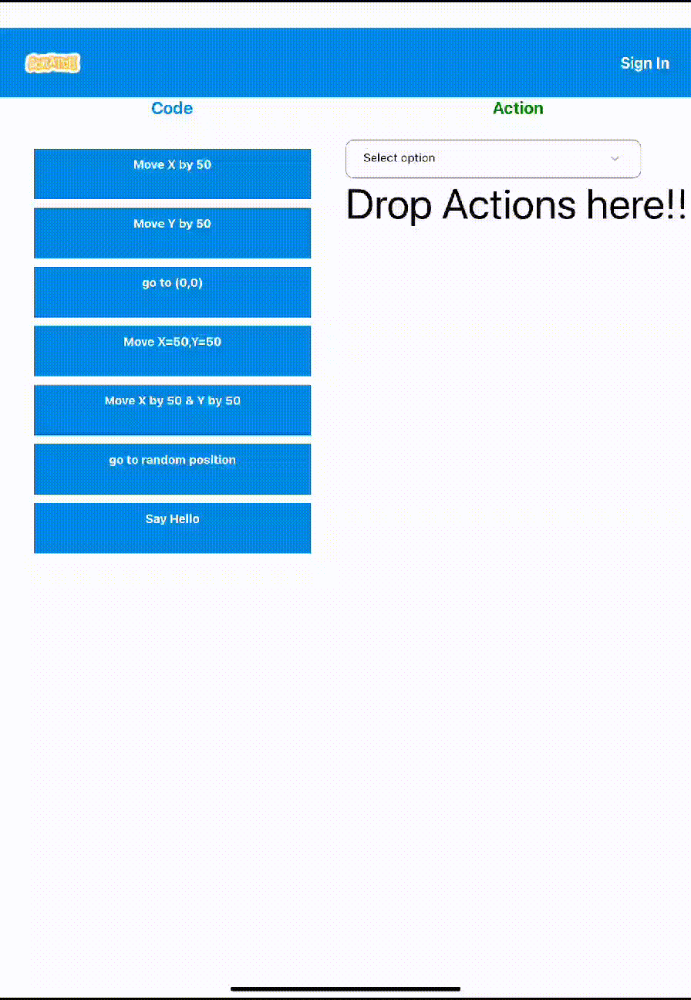

## React Native Sprite Animation Application

## Built Using
- [React Native](https://reactnative.dev/)
- [Context API](https://legacy.reactjs.org/docs/context.html)
- [Animated Library](https://reactnative.dev/docs/animated)
- [Pan Responder](https://reactnative.dev/docs/panresponder)
- [React Native Draggable FlatList](https://www.npmjs.com/package/react-native-draggable-flatlist)

## Demo

Animated Sprite can move anywhere on the screen, Also,an additonal sprite can be added to the screen.

##

|                        |          |
| ----------------------------------- | ----------------------------------- |
|  |  |

User can dynamically add/remove any no of Sprites on the screen

##

Action can be selected by simple drag and drop which will be later performed by the sprite if the user presses play button

##

Actions that are dropped will be visible in the drop area and these can be rearragned by simple dragging the list items.Also these items can be removed by pressing the delete button. 

##

The actions are performed by the sprite when the user clicks the play button

##

Action items are implementing Spring action i.e. if user drags and releases item it gets restores to its orignal position.

